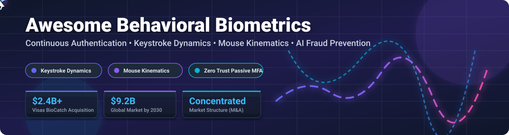

  

# 🧠 Awesome Behavioral Biometrics 🛡️

  
  
  
  
  

---

## 🚀 Overview & Ecosystem

Welcome to the **Awesome Behavioral Biometrics** repository — the definitive curated index of enterprise **SaaS platforms**, **security solutions**, and **open-source frameworks** for **Behavioral Biometrics**, **Continuous Authentication**, **Keystroke Dynamics**, and **Passive Multi-Factor Authentication (MFA)**.

Behavioral biometrics analyze human interaction patterns — typing cadence, mouse dynamics, touch pressure, device micro-movements, and gait — to establish continuous user identity without introducing friction. These technologies power modern **Zero Trust security architectures**, real-time **account takeover (ATO) prevention**, and AI-driven **fraud detection** across banking, e-commerce, and enterprise applications.

---

## 📋 Table of Contents 📌

- [📊 Market Insights & Landscape](#-market-insights--landscape)
- [🏢 SaaS & Hosted Enterprise Platforms](#-saas--hosted-enterprise-platforms)
- [🔓 Open-Source GitHub Repositories](#-open-source-github-repositories)
- [🤝 How to Contribute](#-how-to-contribute)
- [💬 Support & Community](#-support--community)
- [📈 Star History](#-star-history)
- [⚠️ Disclaimer](#%EF%B8%8F-disclaimer)

---

## 📊 Market Insights & Landscape 📈

> **Market Size Estimate**: The global behavioral biometrics market is valued at approximately **$2.1 Billion** and is projected to reach **$9.2 Billion by 2030** (growing at a CAGR of ~23.5%).  
> **Market Structure**: The sector is **highly concentrated** and dominated by major global payments networks and cybersecurity conglomerates. Significant consolidation has occurred through major M&A transactions, including Visa's acquisition of **BioCatch** ($2.4B, 2026) and **Featurespace** (~$925M, 2024), Mastercard's acquisition of **NuData Security**, and LexisNexis' acquisition of **BehavioSec**.

---

## 🏢 SaaS & Hosted Enterprise Platforms 💼

The commercial behavioral biometrics market is ranked below by company valuation and enterprise market capitalization:

| Company / Product 🏢 | Market Size / Valuation 💰 | Starting Pricing 💵 | Free Tier / Trial Limit ⏱️ | Core Focus & Features 🎯 |
| :--- | :--- | :--- | :--- | :--- |
| **[BioCatch](https://www.biocatch.com/)** | **$2,400,000,000** *(Acquired by Visa in 2026)* | $2,500 / month (Tiered by API session volume) | 30-Day Enterprise PoC Trial (Up to 50k test sessions) | Analyzes 2,500+ cognitive & physical interaction signals for banking fraud prevention and ATO detection. |
| **[Featurespace](https://www.featurespace.com/)** | **$925,000,000** *(Acquired by Visa in 2024)* | $3,000 / month (Custom enterprise volume tiers) | 30-Day Sandbox PoC (Limited event rate testing) | Adaptive Adaptive Behavioral Analytics using ARIC risk hub for real-time transaction & interaction fraud prevention. |
| **[Callsign](https://www.callsign.com/)** | **$500,000,000** *(Private enterprise valuation)* | $1,500 / month (Per active authenticated user volume) | 14-Day Enterprise PoC Demo (Up to 10k authentication events) | Deep learning identity intelligence platform combining behavioral biometrics and threat context. |
| **[NuData Security](https://www.nudata.com/)** | **$450,000,000** *(Acquired by Mastercard)* | $2,000 / month (Based on web/mobile monthly active users) | 30-Day Proof of Concept (Restricted sandbox deployment) | Passive biometric analytics (NuDetect) protecting digital touchpoints against botnets and account takeover. |
| **[BehavioSec](https://www.behaviosec.com/)** | **$200,000,000** *(Acquired by LexisNexis Risk Solutions)* | $1,200 / month (Scaled per 100k user profiles) | 30-Day Trial License (Self-hosted developer environment) | Continuous user verification through typing, mouse dynamics, and touchscreen gesture profiling. |
| **[SecuredTouch](https://www.securedtouch.com/)** | **$150,000,000** *(Acquired by Ping Identity)* | $1,000 / month (Ping Identity suite add-on pricing) | 30-Day PingIdentity Partner Trial (Up to 5k test users) | Mobile & web continuous authentication focusing on gesture recognition and anomaly detection. |
| **[ThreatMark](https://threatmark.com/)** | **$80,000,000** *(Est. $15M ARR valuation)* | $800 / month (Per digital banking endpoint tier) | 30-Day Guided Trial (Full feature sandbox access) | Threat detection and behavioral intelligence platform tailored for digital banking fraud prevention. |
| **[Plurilock](https://www.plurilock.com/)** | **$35,000,000** *(Publicly traded TSXV: PLUR, ~$34M revenue)* | $9.00 / user / month (Plurilock DEFEND workstation tier) | 14-Day Workstation Evaluation (Up to 25 endpoint licenses) | Zero Trust continuous workstation authentication via background mouse dynamics and keystroke verification. |
| **[TypingDNA](https://www.typingdna.com/)** | **$25,000,000** *(Series A led by Google Gradient Ventures)* | $0.001 / authentication call ($49/mo minimum) | **Free Forever Tier**: 100 active users / month free | Keystroke dynamics API & JavaScript recorder for 2FA, continuous authentication, and typing verification. |
| **[Zighra](https://www.zighra.com/)** | **$10,000,000** *(Early stage venture backed)* | $500 / month (Device SDK tier) | 30-Day Developer Trial (1,000 active device SDK tokens) | On-device AI engine for frictionless, privacy-first continuous authentication on mobile devices. |

---

## 🔓 Open-Source GitHub Repositories 💻

Explore leading open-source projects for self-hosting, continuous authentication research, keystroke analysis, and dataset generation, sorted by GitHub Stars_Count:

* **[TypingDnaRecorder-JavaScript](https://github.com/TypingDNA/TypingDnaRecorder-JavaScript)**   
  Official JavaScript recorder class from TypingDNA for capturing typing biometrics, inter-key delays, and pattern features directly inside web browsers.

* **[Neuro-Mimesis](https://github.com/sadvik-asus/Neuro_Mimesis)**   
  Cognitive identity verification framework evaluating mouse movement dynamics. Features real-time Trust Score computation and an **Active Defense Protocol** (webcam evidence capture, cursor jitter, and workstation lockdown). Stack: React, Flask, OpenCV, PyAutoGUI.

* **[Bot-Detection](https://github.com/Mouse-BB-Team/Bot-Detection)**   
  Web application protection module implementing behavioral biometrics and mouse tracking algorithms to distinguish human users from automated attack scripts.

* **[Behavior-Based-Authentication](https://github.com/VanGuard2025/Behavior-Based-Authentication)**   
  Real-time ML authentication system continuously verifying users via keystroke dynamics and mouse kinematics. Utilizes GRU sequence models and Autoencoders with drift monitoring and Chart.js streaming.

* **[keystroke-dynamics-datagen](https://github.com/nileshprasad137/keystroke-dynamics-datagen)**   
  Data extraction and generation framework capturing key dwell times, flight times, and typing rhythm metrics to construct benchmark datasets for machine learning research.

* **[KeyStroke-Dynamics](https://github.com/Xenia101/KeyStroke-Dynamics)**   
  Flask-based keystroke verification engine using k-Nearest Neighbors (k-NN) classification and Simhash/Euclidean distance matching, demonstrating high classification accuracy on benchmark datasets.

* **[author-attribution](https://github.com/ridvansalihkuzu/author-attribution)**   
  Social media and messaging authorship attribution engine leveraging behavioral writing rhythms, stylistic patterns, and machine learning models.

* **[cerno](https://github.com/PlawIO/cerno)**   
  Next-generation maze-trace CAPTCHA integrated with real-time behavioral biometrics, rendering verification invisible to legitimate users while blocking AI agents.

* **[generative-mouse-trajectories](https://github.com/jrcalgo/generative-mouse-trajectories)**   
  GAN-based imitation learning engine modeling synthetic human cursor movements. Features Rust-based data collection environment for accessibility testing and biometrics evaluation.

* **[Behavioral-Biometrics](https://github.com/aaryanyaadav/Behavioral-Biometrics)**   
  Django mobile web application collecting touch pressure, swipe dynamics, device tilt, and keystroke metrics with dual storage (Firebase + CSV export).

* **[Open-Behavioral-Auth](https://github.com/topics/behavioral-biometrics)**   
  Privacy-first passive MFA SDK collecting user keystroke rhythms and pointer velocities for risk-based authentication (RBA).

* **[BEACON-Logger](https://zenodo.org/records/20062628)**   
  Multimodal research logger synchronizing 5 data streams: keystrokes, mouse kinematics, PCAP network traffic, hardware IDs, and video ground truth.

* **[SSPRA-State-Space-Perturbation-Resistant-Approach](https://github.com/DrFrankSChen/SSPRA-State-Space-Perturbation-Resistant-Approach)**   
  IEEE T-BIOM continuous authentication state-space temporal modeling framework with sensor fusion across gait and touch biometrics.

* **[BehaveFormer](https://github.com/nganntk/BehaveFormer)**   
  Transformer-based continuous authentication architecture fusing keystroke dynamics and IMU motion sensor data across standard benchmark datasets (Aalto, HMOG, HuMIdb).

---

## 🤝 How to Contribute 💡

Contributions are welcome! Help us keep this security resource accurate and up-to-date.

1. 🍴 **Fork** this repository.
2. 📝 **Add/Edit** entries in `README.md` maintaining table/list structure.
3. 🔗 Include project name, homepage link, Stars_Count/pricing details, and factual description.
4. 🚀 Submit a **Pull Request** with a brief summary of additions.

See the main [Awesome List Community Guidelines](https://github.com/ishandutta2007/Awesome-Awesome-Awesome) for quality standards.

---

## 💬 Support & Community 💖

Thank you for exploring and utilizing the **Awesome Behavioral Biometrics** repository! If this project helps your security research, fraud prevention strategy, or application development, please consider showing your support:

* ⭐ **Star this repository** to improve visibility for the cybersecurity community.
* 🔀 **Fork & Share** with fellow security engineers, identity architects, and researchers.
* ☕ **Sponsor the Maintainer**: Support ongoing curation and open-source contributions via the [GitHub Sponsor Dashboard](https://github.com/sponsors/ishandutta2007).

---

## 📈 Star History 📊

---

## ⚠️ Disclaimer 📜

- This is a **community-curated index** for informational, research, and evaluation purposes only.
- Behavioral biometrics technologies capture sensitive behavioral interaction telemetry and must strictly adhere to global privacy frameworks including **GDPR**, **CCPA**, and biometric privacy mandates such as **Illinois BIPA**.
- Self-hosted open-source security models require comprehensive data collection, tuning, and ongoing validation against behavioral drift and context shifts.

---

  <b>Built with ❤️ for Security Engineers, Fraud Analysts, Identity Architects & Behavioral Researchers worldwide.</b>

